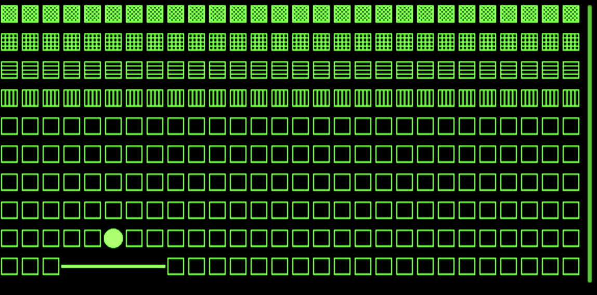

# Arkanoid for Even G2

> See also: [G2 development notes](https://github.com/nickustinov/even-g2-notes/blob/main/G2.md) – hardware specs, UI system, input handling and practical patterns for Even Realities G2.

Arkanoid game for [Even Realities G2](https://www.evenrealities.com/) smart glasses.

Break all bricks with the ball. Swipe to move the paddle, tap to launch. Global best score shared across all players via Redis.

### Play now

Scan this QR code in the Even Realities app (Even Hub page) to play on your G2 glasses with the shared global score system:




## Architecture

The game uses three different page layouts, switching between them via `rebuildPageContainer`:

- **Splash screen** – image container with logo + text container with instructions
- **Gameplay** – text container with unicode grid
- **Game over** – image container with game over graphic + text container with score

A hidden text container with `isEventCapture: 1` and minimal content (`' '`) is present on every page. This receives scroll/tap events without the firmware's internal text scrolling consuming swipe gestures.

During gameplay, only `textContainerUpgrade` is called – no page rebuilds until the game ends.

```
tick() → pushFrame() → sleep(remaining) → repeat
```

The loop awaits each text push before scheduling the next tick. If a push is still in flight, the frame is silently dropped.

### Global best score

The best score is shared across all players via a Redis-backed API (`/api/best-score`). The Vercel serverless function uses a Lua script for atomic compare-and-set – a new score is only written if it exceeds the current value. The Redis key is `arkanoid-even-g2:best`.

On app start, the current best score is fetched and displayed on the splash screen. When the game ends, the score is submitted. If it exceeds the stored value, Redis is updated and the new best is shown immediately.

Without `REDIS_URL` configured, scores won't persist between sessions.

### Grid

- 28 columns × 10 rows
- Rows 0–3: bricks (4 rows × 28 = 112 bricks)
- Rows 4–8: ball play area
- Row 9: paddle (5 chars wide)
- Floating-point physics, snapped to integers at render time
- ~50ms per tick (~20 frames/second)
- Ball speed increases every 10 bricks destroyed

| Element | Character | Unicode |
|---------|-----------|---------|
| Empty | `□` | U+25A1 |
| Ball | `●` | U+25CF |
| Paddle | `━` | U+2501 |
| Brick row 0 | `▩` | U+25A9 |
| Brick row 1 | `▦` | U+25A6 |
| Brick row 2 | `▤` | U+25A4 |
| Brick row 3 | `▥` | U+25A5 |

## Controls

| Input | Action |
|---|---|
| Tap | Start game / launch ball / restart after game over |
| Swipe forward | Move paddle right |
| Swipe backward | Move paddle left |
| Double tap | Start game / restart after game over |

## Project structure

```
g2/
  index.ts       App module registration
  main.ts        Bridge connection and auto-connect
  app.ts         Game loop orchestrator
  state.ts       Game state (paddle, ball, bricks, score, lives)
  game.ts        Physics, collision, brick destruction
  renderer.ts    Text/image rendering, page layouts, frame push
  events.ts      Event normalisation + input dispatch
  layout.ts      Display and grid constants
  logo.png       Splash screen logo (200×100)
  gameover.png   Game over graphic (200×100)
api/
  best-score.js  Vercel serverless function (Redis)
```

## Setup

```bash
npm install
npm run dev
```

### Run with even-dev simulator

```bash
cd /path/to/even-dev
REDIS_URL="redis://..." APP_PATH=/path/to/arkanoid-even-g2 ./start-even.sh
```

Set `REDIS_URL` to enable the global best score API. Without it, scores won't persist.

### Run on real glasses

Generate a QR code and scan it with the Even App:

```bash
npm run dev   # keep running
npm run qr    # generates QR code for http://<your-ip>:5173
```

### Package for distribution

```bash
npm run pack  # builds and creates arkanoid.ehpk
```

## Tech stack

- **G2 frontend:** TypeScript + [Even Hub SDK](https://www.npmjs.com/package/@evenrealities/even_hub_sdk)
- **Build:** [Vite](https://vitejs.dev/)
- **Backend:** [Redis](https://redis.io/) via [ioredis](https://github.com/redis/ioredis) (global best score)
- **Hosting:** [Vercel](https://vercel.com/) (serverless API + static frontend)
- **CLI:** [evenhub-cli](https://www.npmjs.com/package/@evenrealities/evenhub-cli)
